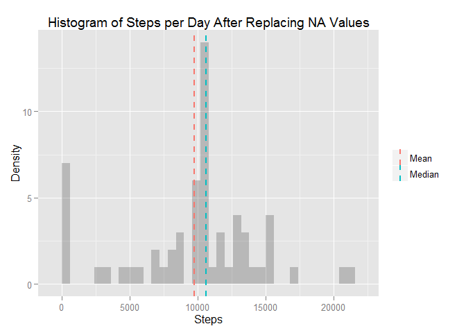

# Reproducible Research: Peer Assessment 1


## Loading and preprocessing the data
Load the "dplyr" and "ggplot" libraries in order to manipulate/aggregate and plot the data, respectively.  The data from the file "activity.csv" is loaded from the "activity" folder that is placed in the directory from which "activity.zip" was extracted:


```r
library("dplyr")
library("ggplot2")
data <- read.csv(file = "activity/activity.csv")
head(data)
```

```
##   steps       date interval
## 1    NA 2012-10-01        0
## 2    NA 2012-10-01        5
## 3    NA 2012-10-01       10
## 4    NA 2012-10-01       15
## 5    NA 2012-10-01       20
## 6    NA 2012-10-01       25
```

## What is mean total number of steps taken per day?
First, we use "dplyr" to group the data by date, and sum the number of steps during each day to get totalSteps:


```r
stepsByDay <- data %>% 
      group_by(date) %>%
      summarize(totalSteps = sum(steps, na.rm = TRUE))

head(stepsByDay)
```

```
## Source: local data frame [6 x 2]
## 
##         date totalSteps
## 1 2012-10-01          0
## 2 2012-10-02        126
## 3 2012-10-03      11352
## 4 2012-10-04      12116
## 5 2012-10-05      13294
## 6 2012-10-06      15420
```

Next, we determine the mean and median of the total number of steps per day:


```r
meanDailySteps <- mean(stepsByDay$totalSteps)
medianDailySteps <- median(stepsByDay$totalSteps)

meanDailySteps
```

```
## [1] 9354.23
```

```r
medianDailySteps
```

```
## [1] 10395
```

The mean daily steps is 9,354.23, and the median daily steps is 10,395.  Note that this includes NA values for "steps" in the dataset.

A histogram of total steps each day, with vertical lines indicating mean and median values:


```r
h <- ggplot(stepsByDay, aes(x = totalSteps))
h <- h + geom_histogram(alpha = 0.25, bidnidth = 600)
h <- h + geom_vline(aes(xintercept = mean(totalSteps), color = "Mean"), 
                    size = 1, linetype = "dashed", show_guide = TRUE)
h <- h + geom_vline(aes(xintercept = median(totalSteps), color = "Median"), 
                    size = 1, linetype = "dashed", show_guide = TRUE)
h <- h + theme(legend.title = element_blank())
h + labs(title = "Histogram of Steps per Day",
              x = "Steps", y = "Density")
```

```
## stat_bin: binwidth defaulted to range/30. Use 'binwidth = x' to adjust this.
```

 


## What is the average daily activity pattern?
To assess the average daily activity pattern, we group the data by time interval:


```r
stepsByInterval <- data %>%
      group_by(interval) %>%
      summarize(averageSteps = mean(steps, na.rm = TRUE))

head(stepsByInterval)
```

```
## Source: local data frame [6 x 2]
## 
##   interval averageSteps
## 1        0    1.7169811
## 2        5    0.3396226
## 3       10    0.1320755
## 4       15    0.1509434
## 5       20    0.0754717
## 6       25    2.0943396
```

A plot of average steps for each interval shows the daily activity pattern:


```r
l <- ggplot(stepsByInterval, aes(x = interval, y = averageSteps))
l <- l + geom_line()
l + labs(title = "Average Steps by Time Interval",
         x = "Time Interval", y = "Average Steps")
```

 

The interval with the highest average number of steps is 835, with just over 206 steps:


```r
maxInterval <- stepsByInterval %>%
      filter(averageSteps == max(averageSteps)) %>%
      select(interval, averageSteps)

maxInterval
```

```
## Source: local data frame [1 x 2]
## 
##   interval averageSteps
## 1      835     206.1698
```

## Imputing missing values
Next, we will replace the instances where "steps" is NA in the dataset.  There are 2,304 rows in the original dataset where "steps" is NA:


```r
NAdata <- data[is.na(data$steps), ]
numNAs <- nrow(NAdata)
numNAs
```

```
## [1] 2304
```

We will replace missing values with the average steps taken during each interval.  First, we find which rows in the original dataset contain NA values. Then, we find the corresponding interval index from the stepsByInterval dataframe for each of the NA values.  This is done by taking the remainder after dividing the interval index by the total number of intervals (the "%%" operation is a mathematical modulo function).  Note that this is the interval INDEX, not the interval VALUE.  Also note that if the remainder is 0, the interval is the last of the 288 intervals (there is no zeroth interval).  Finally, we look up replacement values from the 2nd column of the stepsByInterval dataframe.


```r
NArowNums <- which(is.na(data$steps))                 ## row indices of NA values
NArowIntervals <- NArowNums %% nrow(stepsByInterval)  ## corresponding interval index
NArowIntervals[NArowIntervals == 0] <- 288            ## fix last element
replacementValues <- stepsByInterval[NArowIntervals, 2]
```

A for loop is used to replace the NA values;

```r
data_filled <- data
for (i in seq_along(NArowNums)) {
      data_filled[i, 1] <- replacementValues[i, 1]
}

head(data_filled)
```

```
##       steps       date interval
## 1 1.7169811 2012-10-01        0
## 2 0.3396226 2012-10-01        5
## 3 0.1320755 2012-10-01       10
## 4 0.1509434 2012-10-01       15
## 5 0.0754717 2012-10-01       20
## 6 2.0943396 2012-10-01       25
```

We regroup and replot the histogram of total steps taken each day after replacing the NA values:

```r
stepsByDayNoNAs <- data_filled %>% 
      group_by(date) %>%
      summarize(totalSteps = sum(steps, na.rm = TRUE))

meanDailyStepsNoNAs <- mean(stepsByDayNoNAs$totalSteps)
medianDailyStepsNoNAs <- median(stepsByDayNoNAs$totalSteps)

## histogram plot of steps per day after romoval of NAs
h <- ggplot(stepsByDayNoNAs, aes(x = totalSteps))
h <- h + geom_histogram(alpha = 0.25, binwidth = 600)
h <- h + geom_vline(aes(xintercept = mean(totalSteps), color = "Mean"), 
                    size = 1, linetype = "dashed", show_guide = TRUE)
h <- h + geom_vline(aes(xintercept = median(totalSteps), color = "Median"), 
                    size = 1, linetype = "dashed", show_guide = TRUE)
h <- h + theme(legend.title = element_blank())
h + labs(title = "Histogram of Steps per Day After Replacing NA Values",
         x = "Steps", y = "Density")
```

 

## Are there differences in activity patterns between weekdays and weekends?
In order to determine if there are any differences in step activity during weekdays and on weekends, we add a "weekday" variable, group the data by weekday and interval, calculate average steps, and then add a second new variable named "dayType" to categorize each day as a weekday or weekend day:


```r
data_filled$weekday <- weekdays(as.Date(data_filled$date), abbreviate = FALSE)

stepsByIntervalWkDay <- data_filled %>% 
      group_by(weekday, interval) %>%
      summarize(averageSteps = mean(steps, na.rm = TRUE)) %>%
      ungroup()

stepsByIntervalWkDay$dayType <- "weekday"
stepsByIntervalWkDay[stepsByIntervalWkDay$weekday %in% c("Saturday", "Sunday"), 4] <- "weekend"

head(stepsByIntervalWkDay)
```

```
## Source: local data frame [6 x 4]
## 
##   weekday interval averageSteps dayType
## 1  Friday        0   0.24528302 weekday
## 2  Friday        5   0.04851752 weekday
## 3  Friday       10   0.01886792 weekday
## 4  Friday       15   0.02156334 weekday
## 5  Friday       20   0.01078167 weekday
## 6  Friday       25   0.29919137 weekday
```

If we plot the average daily steps over time for weekdays and weekends, it is clear that activity begins later on weekends:


```r
l2 <- ggplot(stepsByIntervalWkDay, aes(x = interval, y = averageSteps))
l2 <- l2 + geom_line()
l2 <- l2 + facet_grid(dayType ~ .)
l2 + labs(title = "Average Steps by Time Interval",
         x = "Time Interval", y = "Average Steps")
```

 
